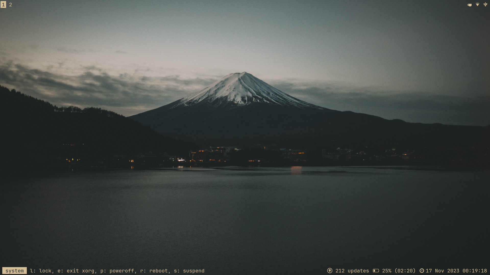
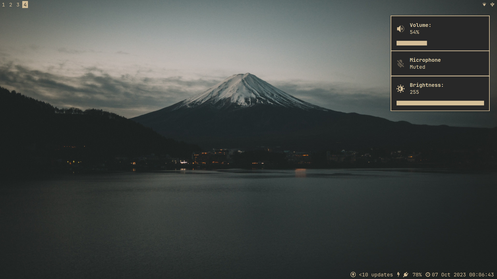
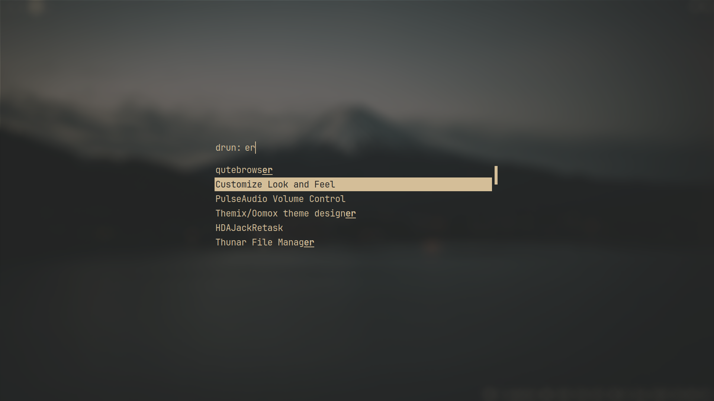
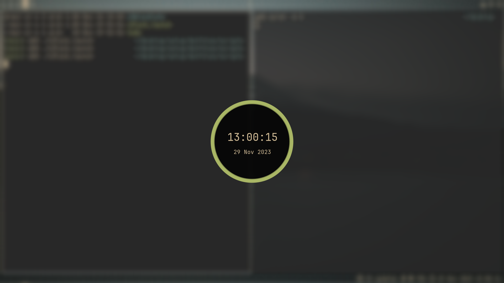
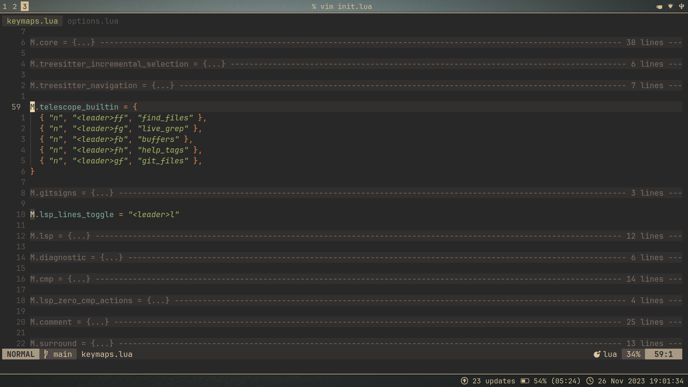

# dotfiles
These are my personal dotfiles. As such, a lot of the configuration are tinkered for my use and liking. Feel free to copy the stuff you like and understand, and leave the rest.

Use `stow.sh` after testing `stow` out on dummy configs. It's a wonderful program, but the way I use it might leave behind some clutter and/or break your configuration, if you don't use it properly. 

Special dependencies are written within the files themselves. Most dependencies should be inferrable (or throw errors if missing). I use [this](https://github.com/abxh/gruvbox-material-gtk) icon theme in the screenshots and in my dunstify scripts as default.

To clone this repo with the submodules, run:
```
git clone --recurse-submodules https://github.com/abxh/dotfiles
```

For the neovim config, use [ellisonleao/gruvbox.nvim](https://github.com/ellisonleao/gruvbox.nvim) and
the colors specified [here](https://github.com/abxh/nvim-config/blob/e668b291b1cbbf985dab68626f234d43e4742018/lua/plugins/gruvbox.lua)
to get something like the screenshots.

## Previews
<p float="left">
  
  
  
  
  
  
</p>

> The [wallpaper](https://wallhaven.cc/w/j5p23m) used.
