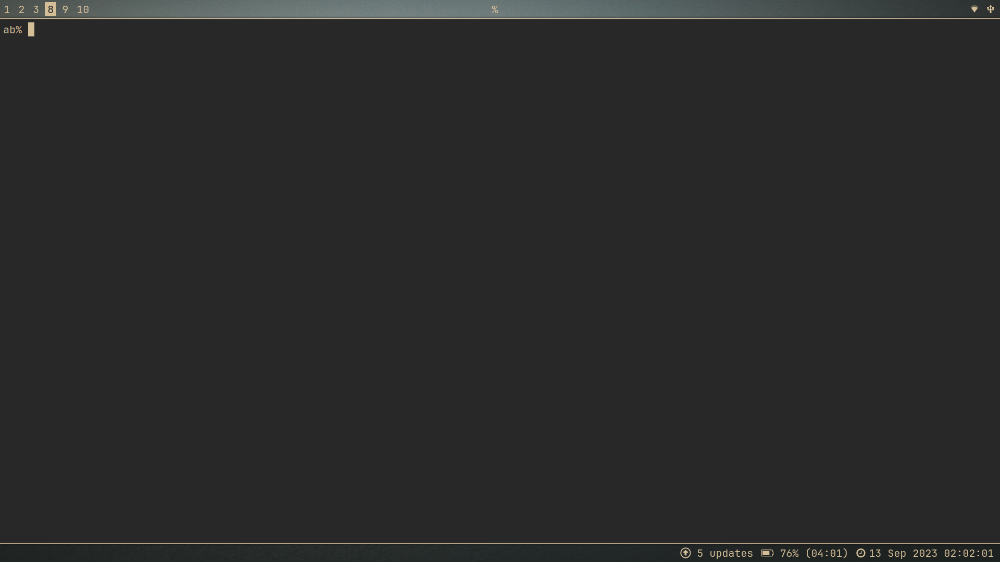
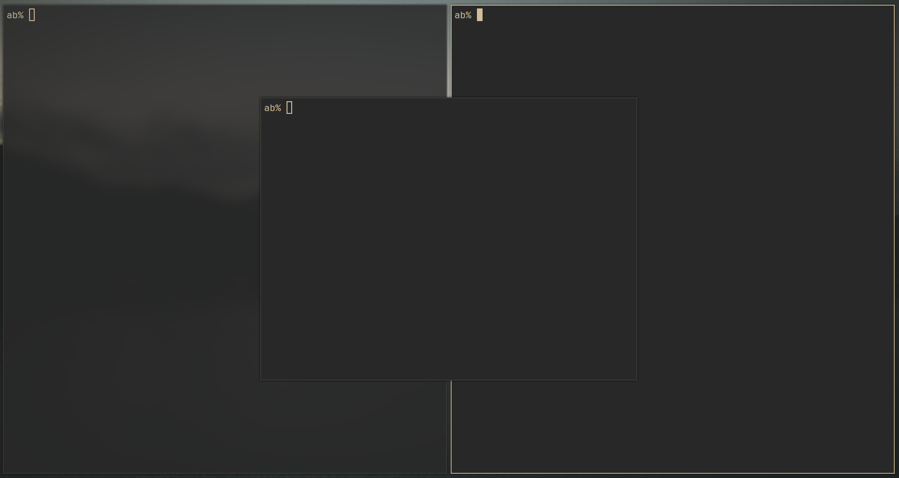
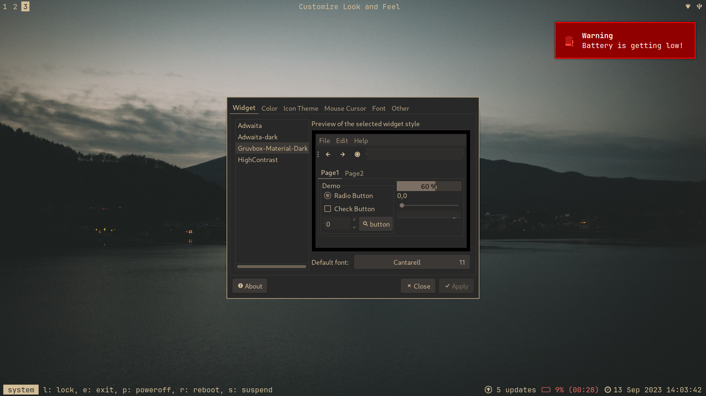
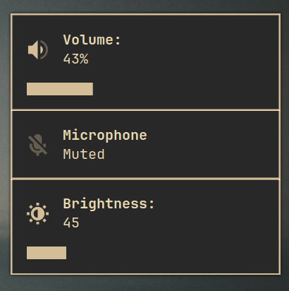
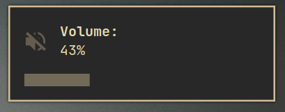
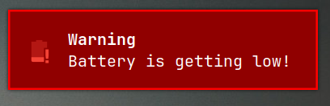
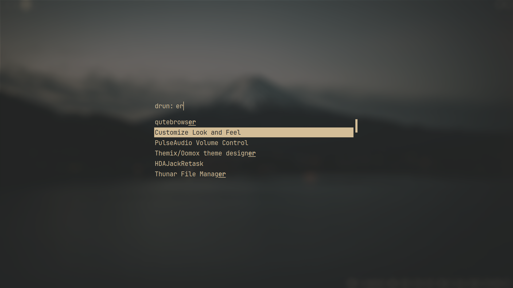
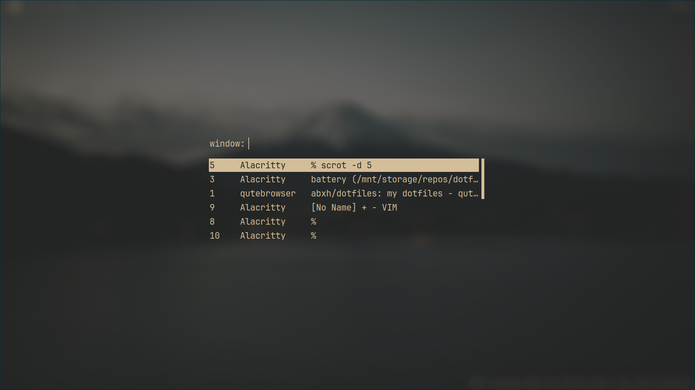

# dotfiles
## Notable ricing

Opinationed border and transparency logic:





Transparent bars with nice colors and blocklets:



Notifications:







And finally as of lately, a *proper* rice of rofi ;) :





> [This wallpaper](https://wallhaven.cc/w/j5p23m>) is used in the previews.

## Intro
Hey there, :). Welcome to my dotfiles. 

If you wish to use my dotfiles, please note that the dotfiles are modified to suit my laptop, so some hardcoded things might not work as expected in other pcs.

With my dotfiles, I strive to achieve a certain level of elegance and beauty without using a lot of colors and keeping it look simple.

Here is a [list of dependencies and others](https://github.com/abxh/dotfiles/blob/main/dependencies.md). I do not garantee the completeness of the list.

> **Note:** The following hyperlinks point to directories in this repo.

The window manager [i3](https://github.com/abxh/dotfiles/tree/main/i3/config) is used with [sxhkd](https://github.com/abxh/dotfiles/tree/main/sxhkd), which sets all the keybindings except modes.

The fancy blur effect and other effects comes from [picom](https://github.com/abxh/dotfiles/tree/main/picom/picom.conf).

The bar uses [i3bar](https://github.com/abxh/dotfiles/tree/main/i3/i3bar), [i3blocks](https://github.com/abxh/dotfiles/tree/main/i3blocks) and [scripts](https://github.com/abxh/dotfiles/tree/main/scripts) to achieve it's magic.

Notifications are done through [dunst with scripts](https://github.com/abxh/dotfiles/tree/main/dunst).

Both the bar and notifications use icons from [my fork of the gruvbox-material-gtk theme](https://github.com/abxh/gruvbox-material-gtk) (with OneColored Icons).

A combination of [zsh](https://github.com/abxh/dotfiles/tree/main/zsh), [Alacritty](https://github.com/abxh/dotfiles/tree/main/alacritty) and [vim](https://github.com/abxh/dotfiles/tree/main/vim/.vimrc)
is used as the shell, terminal and editor.

And finally [qutebrowser](https://github.com/abxh/dotfiles/tree/main/qutebrowser) is used. It is a keyboard-driven browser with vim-like bindings.

## Tree View
```
.
├── .images
│   ├── i30.png
│   ├── notifs0.png
│   ├── notifs1.png
│   ├── notifs2.png
│   ├── rofi0.png
│   ├── rofi1.png
│   ├── window0.png
│   └── window1.png
├── alacritty
│   ├── alacritty.yml
│   └── gruvbox_material.yml
├── betterlockscreen
│   └── betterlockscreenrc
├── dunst
│   ├── 90-backlight.rules
│   ├── dunstify_bat
│   ├── dunstify_br
│   ├── dunstify_vol
│   └── dunstrc
├── i3
│   ├── modes
│   │   ├── resize
│   │   └── system
│   ├── config
│   └── i3bar
├── i3blocks
│   ├── bottom
│   └── top
├── lf
│   ├── icons
│   └── lfrc
├── mpd
│   └── mpd.conf
├── mpv
│   └── mpv.conf
├── ncmpcpp
│   └── config
├── picom
│   └── picom.conf
├── qutebrowser
│   ├── config.py
│   └── gruvbox.py
├── rofi
│   └── config.rasi
├── scripts
│   ├── autoname_workspaces.py
│   ├── battery
│   ├── calendar
│   ├── focused_window.py
│   ├── focused_window_update.py
│   ├── i3nag_exit
│   ├── sxhkd_restart
│   ├── todo
│   └── xidlehook
├── sxhkd
│   ├── i3-keys
│   └── wm-independent-keys
├── vim
│   └── .vimrc
├── xorg
│   ├── .Xresources
│   └── .xinitrc
├── zathura
│   └── zathurarc
├── zsh
│   ├── .zsh
│   │   └── lean
│   │       └── ...
│   ├── .zprofile
│   ├── .zshenv
│   └── .zshrc
├── .gitmodules
├── LICENSE
├── README.md
├── dependencies.md
└── stow.sh
```
